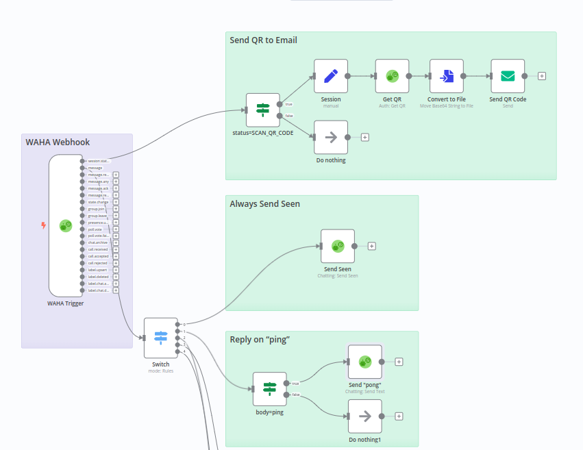

# @devlikeapro/n8n-nodes-waha
<p align="center">
  
</p>

This is a n8n community node. 
It lets you use [WAHA - WhatsApp HTTP API](https://waha.devlike.pro) in your n8n workflows.

- [**WAHA**](https://waha.devlike.pro) - **WhatsApp API** that you can run in a click!
- [n8n](https://n8n.io/) is a [fair-code licensed](https://docs.n8n.io/reference/license/) workflow automation platform.


- [Installation](#installation)
  - [Install WAHA](#install-waha)
  - [Install n8n](#install-n8n)
  - [Install WAHA node](#install-waha-node)
- [Credentials](#credentials)
- [Usage](#usage)
- [Workflow Examples](#workflow-examples)



## Installation

### Install WAHA
Make sure you have WAHA up and running. If not - follow 
[**⚡ Quick Start**](https://waha.devlike.pro/docs/overview/quick-start/)
so you have WAHA available on http://localhost:3000/

### Install n8n
Kindly follow [n8n Installation guide](https://docs.n8n.io/hosting/installation/docker/#starting-n8n) for that part.


### Install WAHA node
Go to your n8n installation => **Settings** => **Community nodes** and install:

```
@devlikeapro/n8n-nodes-waha
```

Follow the [installation guide](https://docs.n8n.io/integrations/community-nodes/installation/) in the n8n community nodes documentation.

## Credentials

Before using the node you need to add **WAHA API** credentials. 
If it doesn't allow you to **Save** it (no save button) - just put any string in `Api Key` field, know issue :(

## Usage
You can check the workflows and how to use WAHA n8n Nodes
1. Go to your n8n installation with installed **WAHA** node.
2. **Add workflow** there (just empty one)
3. Import one of the examples below by clicking on three dots **...** at the right top corner 
of the n8n window and selecting **Import from URL**.
4. Paste the url to import workflow
5. Select credentials for all WAHA nodes
6. Configure you session to send event to **WAHA Trigger** Webhook URL
7. Activate the workflow
8. Enjoy low-code automation!


## Workflow Examples
[WAHA - Workflow Example](https://raw.githubusercontent.com/devlikeapro/n8n-nodes-waha/master/n8n-workflows/WAHA___Workflow_Examples.json) 
- Mark message as seen
- Send "pong" on "Ping"
- Send image on "Image"
- Send video on "Video"
- Send all text messages to email

[WAHA - Restart Server At Midnight](https://raw.githubusercontent.com/devlikeapro/n8n-nodes-waha/master/n8n-workflows/WAHA___Restart_Server_At_Midnight.json)
- Restart WAHA server at midnight

