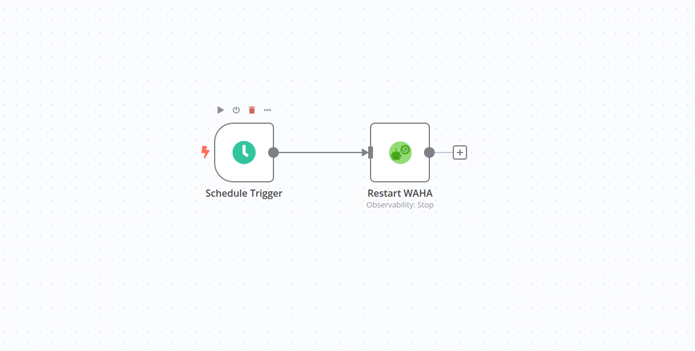

# N8N WAHA Workflows Examples
You can import the workflows:
1. Go to your n8n installation with installed **WAHA** node.
2. **Add workflow** there (just empty one)
3. Import one of the [**examples**](./n8n-workflows) by clicking on three dots **...** at the right top corner
	 of the n8n window and selecting **Import from URL**.
4. Paste the url to import workflow
5. Select credentials for all WAHA nodes
6. Configure you session to send event to **WAHA Trigger** Webhook URL
7. Activate the workflow
8. Enjoy low-code automation!

## Examples

### Chatting Workflow Examples
[Chatting Workflow Examples](https://raw.githubusercontent.com/devlikeapro/n8n-nodes-waha/master/n8n-workflows/WAHA___Workflow_Examples.json)

A simple template that demonstrates how to use WAHA nodes to chat with your WhatsApp number.
- Send QR code to Email
- Mark message as seen when received
- Send "pong" text on "Ping" message
- Send an image on "Image" message
- Send video on "Video" message
- Send WhatsApp incoming message to Email

### Restart Server At Midnight
[WAHA - Restart Server At Midnight](https://raw.githubusercontent.com/devlikeapro/n8n-nodes-waha/master/n8n-workflows/WAHA___Restart_Server_At_Midnight.json)

Simple template to restart your server at midnight.

